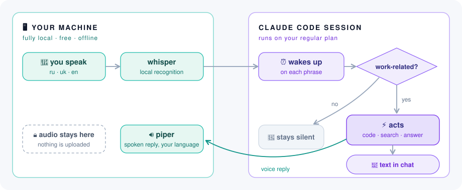

# VibeTalk — a Claude Code voice plugin

**Vibe-code hands-free: no keyboard, just talk.**

Talk to your session hands-free. It listens in the background, decides on its own when a phrase is work-related, and replies with voice and text. Speech recognition (faster-whisper) and synthesis (piper) run fully locally — the only cost is your session's regular messages.

## Install

```bash
# 1. Add the marketplace (git URL or local path)
/plugin marketplace add muzik05/vibetalk

# 2. Install the plugin
/plugin install vibetalk@vibetalk
```

Then, in any session: **`/voice`** (or just say "start voice mode"). The first run sets everything up automatically — nothing to configure by hand. One-time download, ~1.2 GB total:

| What | Size |
|---|---|
| Python packages (faster-whisper, piper, onnxruntime) | ~220 MB |
| Speech-recognition model (whisper small, auto-fetched) | ~460 MB |
| Voice pack (EN / UK and more) | ~520 MB |

## Controls

A small always-on-top panel appears automatically and is the single control surface:

| Control | What it does |
|---|---|
| 🎤 **listen** | toggles whether the assistant hears you |
| 🔊 **speak** | toggles spoken replies; switching off also cuts the current playback |
| 🔁 **echo cancel** | needed when replies play through speakers next to the mic; set automatically when you pick a device (on for the laptop speakers, off in headphones), and can be flipped by hand |
| **language** | auto-detect or pin EN / UK / RU |
| **recognition** | local, or cloud (OpenAI / Groq) with your key |
| **device** | shown when more than one audio device is connected — laptop, Bluetooth or USB headset; moves both sound and mic. A headset whose mic gives no audio keeps the laptop mic (`mic: laptop`) |
| **voices** | pick a voice per language |
| ⎯ / ⏻ | minimize / stop voice mode |

Drag the panel by its background; it remembers where you left it. If the selected device disconnects, sound and mic fall back to the laptop.

You can also control everything by voice: say "quiet" / "speak", and to interrupt the assistant — just start talking over it (barge-in).

## Driving Claude Desktop by voice

Linux/X11 with `xdotool` only; elsewhere these phrases simply go to the model.

**App commands** — short phrases run instantly and do not wake the model: "new session", "palette", "sidebar", "close / reopen tab", "stop Claude" (interrupt generation), "enter", "hide / show Claude", "dictate <text>", "palette <text>". RU/UK/EN; the phrase list lives in `scripts/commands.py`.

**Sessions** — the model resolves the session by name or task number, even when the number is misheard:

| Say | What happens |
|---|---|
| "open session 1265" | the session opens on screen; the voice stays where it is |
| "switch to 1265" | the session opens and takes over the voice |
| "answer here" | the utterance goes to the session currently open in the window |

## How it works

<p align="center">
  
</p>

Nothing leaves your machine except the recognized text of work-related phrases, which goes into your Claude Code session like a typed message. Replies come back in the language you spoke: English (voice: lessac), Ukrainian (voice: mykyta) — and the auto-detection handles more languages out of the box.

## Optional: cloud recognition

Recognition is fully local by default. If you want the laptop completely silent, switch the STT engine in the panel to ☁ openai or ☁ groq and put an API key into `~/.voice-assistant/stt.conf`. Trade-off: audio snippets are sent to that provider (the "audio stays here" promise applies to local mode only). Cost is pennies — ~$0.006/min on OpenAI; Groq has a free tier. No key or no network — it falls back to local automatically.

## Requirements

- Python 3.10+, a microphone
- ~1.2 GB of disk space (see the download table above)

| Platform | What you get | Extra setup |
|---|---|---|
| **Linux** (PipeWire/Pulse) | everything — echo cancellation, barge-in, control panel | none |
| **macOS** | listening and speaking; no echo cancellation, so use headphones | none — capture goes through PortAudio |
| **Windows** | listening and speaking; no echo cancellation, so use headphones | none — the PortAudio wheel is self-contained |
| iOS / Android | not supported | — |

Echo cancellation is what lets you interrupt the assistant mid-sentence, and it
comes from PipeWire — so that one feature stays Linux-only. Everywhere else,
headphones do the same job: the microphone simply never hears the reply.

Neither macOS nor Windows needs a system audio package: capture and playback
fall back to PortAudio, which ships inside the Python wheel. `sox` is still used
on macOS when it happens to be installed, but is no longer required.

## License

Free and open source under the [MIT License](LICENSE). VibeTalk is an independent project, not affiliated with Anthropic; Claude Code and all rights to it belong to Anthropic. We're just developers who want using it to feel great.

---

Made by [muzik05](https://github.com/muzik05). Thanks to [Generect](https://generect.com) — the company I work at.
